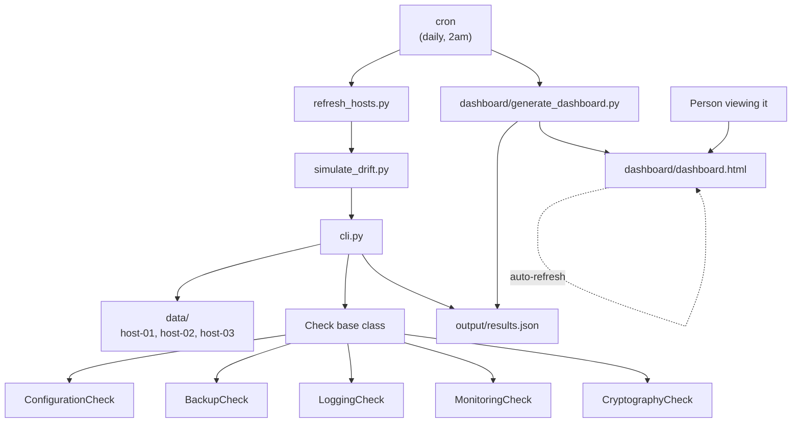
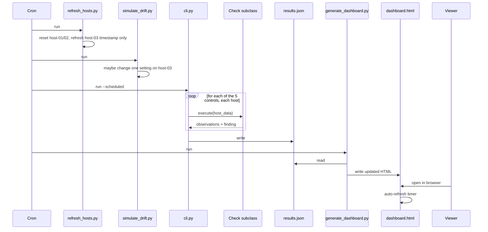
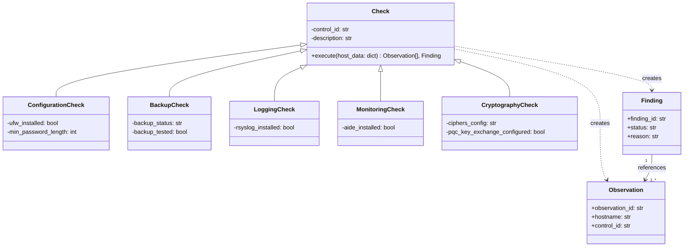
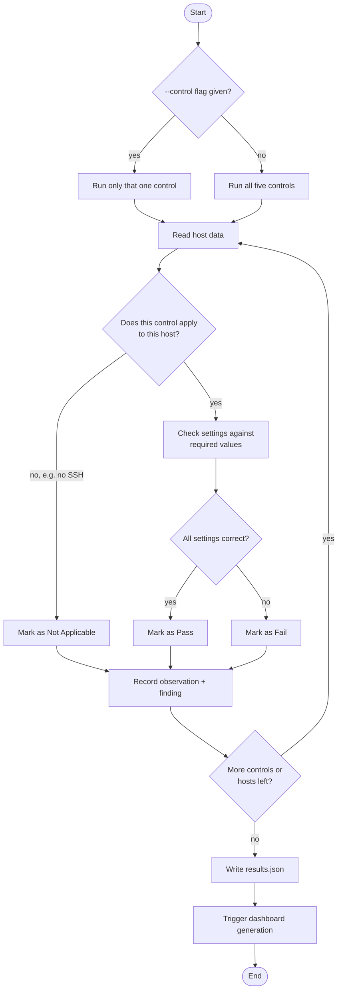

# System Diagrams

---

## 1. Architecture

Shows the main pieces of the system and how they connect.

---

## 2. Sequence (one full cycle)

Shows the order things happen in, step by step, during one automatic run.

---

## 3. Class diagram

Shows how the code itself is structured, one shared base, five checks built on it.

---

## 4. Activity diagram (decision logic)

Shows the actual decisions the CLI makes while running, not just the order of events.

